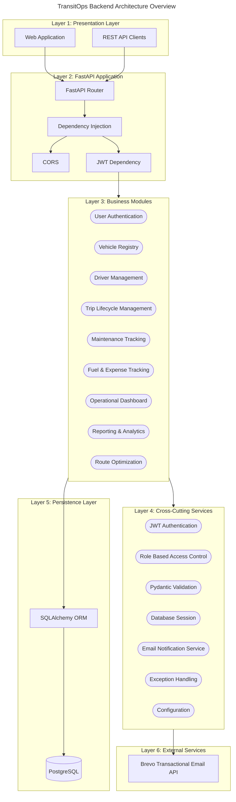

# TransitOps Backend Architecture Overview

## Purpose

TransitOps uses a modular monolith architecture because the backend serves a cohesive operations domain: fleet records, drivers, trip dispatch, maintenance, expenses, dashboards, reports, and route suggestions. Keeping these capabilities inside one deployable FastAPI backend reduces operational complexity while still separating business responsibilities into clearly named modules.

FastAPI is used because it provides a concise HTTP API layer with dependency injection, request validation integration, OpenAPI support, and strong ergonomics for Python backend development. SQLAlchemy is used as the ORM so business services can work with explicit Python models while persisting data reliably into PostgreSQL.

PostgreSQL is the system of record for all operational data because the application is relational by nature: vehicles, drivers, trips, expenses, fuel logs, maintenance records, and route suggestions all depend on structured relationships. JWT authentication protects API access with bearer tokens, while role based access control enforces business permissions for fleet managers, drivers, safety officers, and financial analysts.

## Architecture Overview

The backend is organized as a layered modular monolith.

Presentation Layer receives user and client interaction through the web application and REST API clients. This layer does not own backend business rules; it submits requests to the API and renders responses.

Application Layer is the FastAPI application boundary. It owns HTTP routing, dependency injection, CORS handling, JWT dependency resolution, request validation entry points, and response delivery.

Business Layer contains the implemented TransitOps business modules. Each module owns a business capability such as User Authentication, Vehicle Registry, Driver Management, Trip Lifecycle Management, Maintenance Tracking, Fuel & Expense Tracking, Operational Dashboard, Reporting & Analytics, or Route Optimization.

Persistence Layer contains SQLAlchemy ORM and PostgreSQL. Business modules use SQLAlchemy sessions to query and mutate application data, and PostgreSQL stores the durable operational records.

External Services contains Brevo Transactional Email API, which is used by the shared email notification service for login and trip-status notifications.

## Diagram Legend

- Rectangle: application layer component
- Rounded rectangle: business module or cross-cutting service
- Cylinder: database
- External service boundary: third-party service

## System Architecture Diagram

## Architecture Description

Requests enter TransitOps through the Presentation Layer. A web application or REST API client calls the FastAPI backend through the `/api` route surface. The backend is responsible for translating HTTP requests into validated application operations.

The FastAPI Application layer owns routing and dependency resolution. Routers receive requests, Pydantic validates request bodies and query parameters, and dependency injection provides database sessions and authenticated users where required.

Authentication is centralized through JWT bearer tokens. Login creates a token after email and password verification. Protected routes decode the token, validate expiry, locate the user account, and pass the authenticated user into the route handler.

Authorization is handled through role based access control. Business operations such as creating vehicles, managing drivers, dispatching trips, closing maintenance, and creating expenses require specific roles. The implemented roles are `fleet_manager`, `driver`, `safety_officer`, and `financial_analyst`.

The Business Layer is separated by capability rather than by technical type. User Authentication owns login and current-user behavior. Vehicle Registry owns fleet records. Driver Management owns driver records and availability. Trip Lifecycle Management owns draft, dispatch, complete, and cancel transitions. Maintenance Tracking owns maintenance state. Fuel & Expense Tracking owns cost records. Operational Dashboard and Reporting & Analytics aggregate operational visibility. Route Optimization owns route suggestions.

Modules communicate through shared database state and direct in-process service calls where implemented. The backend is not distributed, so there are no network calls between modules, no message brokers, and no event bus. This keeps the system simple to understand and demonstrate during a hackathon evaluation.

Persistence is shared through SQLAlchemy ORM and PostgreSQL. Business modules use SQLAlchemy sessions supplied by the application infrastructure. PostgreSQL stores user accounts, vehicles, drivers, trips, maintenance logs, fuel logs, expenses, and route suggestions.

Cross-cutting services are reused across modules. JWT Authentication, Role Based Access Control, Pydantic Validation, Database Session handling, Exception Handling, Configuration, and Email Notification Service provide common capabilities without each module reimplementing them.

Email notifications are implemented through Brevo Transactional Email API. The backend sends successful-login and trip-status-change notifications through the shared email notification service. If email configuration is missing or delivery fails, the service handles that result without introducing a queue or background worker.

This architecture was selected because TransitOps needs business capability separation without the deployment and operational overhead of distributed systems. The modular monolith supports high cohesion, low coupling, centralized authentication, shared persistence, simple deployment, and clear business boundaries.

## Design Decisions

| Decision | Reason |
| --- | --- |
| Modular Monolith | Keeps all backend capabilities in one deployable service while preserving clear module boundaries by business capability. |
| FastAPI | Provides efficient HTTP routing, dependency injection, validation integration, and strong Python API development ergonomics. |
| SQLAlchemy | Provides ORM-based persistence over relational operational data while keeping database access explicit and inspectable. |
| JWT | Enables stateless bearer-token authentication for protected API routes. |
| RBAC | Enforces business permissions for fleet managers, drivers, safety officers, and financial analysts. |
| PostgreSQL | Provides durable relational storage for vehicles, drivers, trips, costs, reports, and route suggestions. |
| Brevo | Provides the implemented transactional email capability for login and trip-status notifications. |

