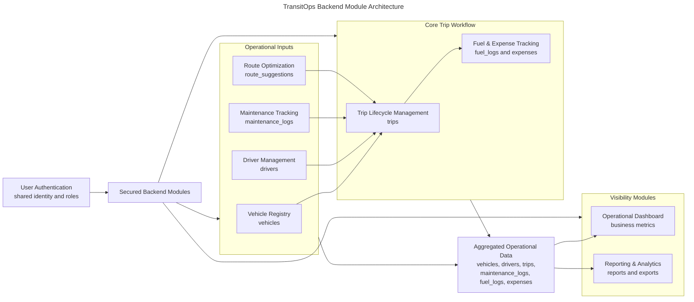

# TransitOps Backend Module Architecture

## Purpose

TransitOps is organized into backend modules so each part of the system can own a clear business capability. This keeps operational rules close to the capability they belong to, such as vehicles, drivers, trips, maintenance, expenses, reporting, or route planning.

Separating modules by business capability makes the backend easier to understand, test, extend, and present to technical evaluators. Each module has a focused responsibility, while shared authentication and shared persistence keep the overall system consistent.

## Module Organization

Every backend module owns one business capability. The implemented modules are:

- User Authentication
- Vehicle Registry
- Driver Management
- Trip Lifecycle Management
- Maintenance Tracking
- Fuel & Expense Tracking
- Operational Dashboard
- Reporting & Analytics
- Route Optimization

The modules are organized around operational business areas rather than technical categories. Vehicle Registry owns fleet records, Driver Management owns driver profiles, Trip Lifecycle Management owns trip operations, and the remaining modules provide supporting operational capabilities such as servicing, cost tracking, metrics, reporting, and route suggestions.

## Backend Module Architecture Diagram

## Module Responsibilities

| Module | Primary Responsibility | Primary Data |
| --- | --- | --- |
| User Authentication | User login, token issuance, current-user identity, and shared secured access | `user_accounts` |
| Vehicle Registry | Fleet records, vehicle availability, vehicle regions, and vehicle lifecycle data | `vehicles` |
| Driver Management | Driver profiles, license validity, safety score, and driver availability | `drivers` |
| Trip Lifecycle Management | Trip creation, dispatch, completion, cancellation, and operational trip state | `trips` |
| Maintenance Tracking | Vehicle servicing records and maintenance status management | `maintenance_logs` |
| Fuel & Expense Tracking | Operational cost tracking for fuel usage and vehicle expenses | `fuel_logs`, `expenses` |
| Operational Dashboard | Business metrics and operational summary data | aggregated operational data |
| Reporting & Analytics | Operational reports, CSV exports, and PDF exports | aggregated reporting data |
| Route Optimization | Suggested route distance and duration records | `route_suggestions` |

## Module Dependency Explanation

User Authentication is shared across secured backend modules. It provides the identity and role context needed before protected business operations are allowed.

Trip Lifecycle Management depends on Vehicle Registry because every trip requires a valid and available vehicle. It depends on Driver Management because every trip requires an eligible driver. It also relates to Maintenance Tracking because vehicle service status affects operational availability, and it relates to Fuel & Expense Tracking because completed trips can produce fuel records.

Operational Dashboard depends on aggregated operational data from trips, vehicles, drivers, maintenance records, fuel logs, and expenses. It summarizes the current state of the business rather than owning the underlying operational records.

Reporting & Analytics depends on aggregated business information from trips, expenses, maintenance records, drivers, and vehicles. It turns operational data into structured reports and exportable business views.

Route Optimization supports trip planning by providing suggested routes that may be associated with trips. It does not own trip state, but it contributes route planning data that helps the trip workflow.

## Module Design Principles

The backend follows business capability separation so each module has a clear reason to exist. Each module focuses on one responsibility and keeps related operational behavior together.

Shared authentication gives the backend consistent secured access across modules. Shared persistence gives modules a common operational data source while keeping each module focused on its own business area.

The design supports independent evolution because modules can be extended within their capability boundaries. Loose coupling and high cohesion make the backend easier to reason about during development, review, and hackathon demonstration.

## Key Takeaways

- TransitOps contains nine implemented backend modules.
- Each module maps to a specific business capability.
- User Authentication is shared across secured modules.
- Trip Lifecycle Management coordinates vehicles, drivers, maintenance relevance, and fuel outcomes.
- Operational Dashboard and Reporting & Analytics read aggregated business data.
- Route Optimization supports trip planning through route suggestions.
- The module structure favors high cohesion and low coupling.
- The backend is organized for clear operational understanding and future contribution.
