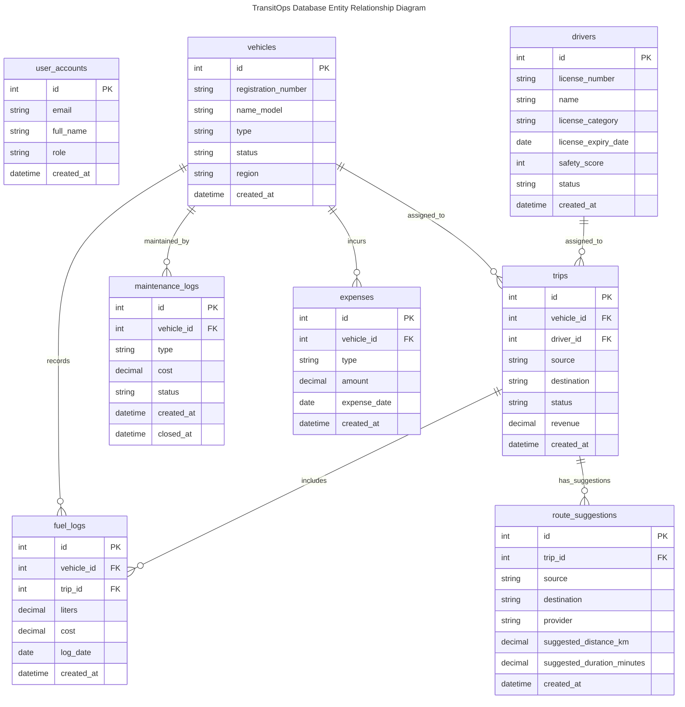

# TransitOps Database Architecture

## Purpose

TransitOps uses PostgreSQL because the backend manages structured operational data with clear identities, statuses, ownership, and relationships. Vehicles, drivers, trips, maintenance records, fuel logs, expenses, user accounts, and route suggestions all fit naturally into a relational database model.

SQLAlchemy ORM is used to map Python backend models to PostgreSQL tables while keeping database access explicit and consistent across modules. The ORM gives the FastAPI backend a typed model layer for queries, inserts, updates, relationships, and transaction commits.

Relational data is appropriate because TransitOps depends on referential integrity between operational records, especially trips linked to vehicles and drivers, fuel logs linked to vehicles and optionally trips, and maintenance or expense records linked to vehicles.

## Database Overview

TransitOps stores operational data using a shared relational model. The database is the single source of truth for authentication records, fleet assets, driver profiles, trip lifecycle state, vehicle maintenance, fuel usage, expenses, reporting inputs, dashboard metrics, and route suggestions.

Business modules share one common PostgreSQL database. Each business capability owns one or more entities, while read-oriented modules such as Operational Dashboard and Reporting & Analytics aggregate data from existing operational tables.

The schema is intentionally direct: core records are represented as tables, relationships are represented with foreign keys, and business services use SQLAlchemy sessions to persist state changes transactionally.

## Module → Table Mapping

| Module | Primary Table(s) |
| --- | --- |
| User Authentication | `user_accounts` |
| Vehicle Registry | `vehicles` |
| Driver Management | `drivers` |
| Trip Lifecycle Management | `trips` |
| Maintenance Tracking | `maintenance_logs` |
| Fuel & Expense Tracking | `fuel_logs`, `expenses` |
| Operational Dashboard | Aggregated operational queries |
| Reporting & Analytics | Aggregated reporting queries |
| Route Optimization | `route_suggestions` |

## Entity Relationship Diagram

## Business Rules

One vehicle can be assigned to many trips over time. Each trip references one vehicle through `trips.vehicle_id`.

One driver can be assigned to many trips over time. Each trip references one driver through `trips.driver_id`.

One vehicle can have many maintenance records. Each maintenance record references one vehicle through `maintenance_logs.vehicle_id`.

One vehicle can have many fuel logs. Each fuel log references one vehicle through `fuel_logs.vehicle_id`.

One trip can have zero or many fuel logs. The relationship is optional from the fuel log side because `fuel_logs.trip_id` is nullable.

One vehicle can have many expenses. Expenses are linked to vehicles through `expenses.vehicle_id` in the implemented schema.

One trip can have zero or many route suggestions. Route suggestions may exist without a trip because `route_suggestions.trip_id` is nullable, and the implemented schema does not enforce a one-to-one route suggestion limit per trip.

User accounts are standalone authentication records. They do not hold foreign keys to operational entities in the implemented schema.

## Entity Descriptions

| Entity | Purpose | Owner Module |
| --- | --- | --- |
| `user_accounts` | Stores user credentials, identity, and role information for secured backend access | User Authentication |
| `vehicles` | Stores fleet assets, registration identifiers, capacity, region, and operational status | Vehicle Registry |
| `drivers` | Stores licensed drivers, license validity, safety score, contact information, and availability status | Driver Management |
| `trips` | Stores operational trips, assigned vehicle and driver, route endpoints, revenue, and lifecycle status | Trip Lifecycle Management |
| `maintenance_logs` | Stores vehicle service records, service cost, service status, and closure timestamp | Maintenance Tracking |
| `fuel_logs` | Stores vehicle fuel usage, fuel cost, log date, and optional trip association | Fuel & Expense Tracking |
| `expenses` | Stores vehicle-related operational expenses and expense dates | Fuel & Expense Tracking |
| `route_suggestions` | Stores route suggestion outputs, provider, distance, duration, and optional trip association | Route Optimization |

## Referential Integrity

Every implemented table uses a primary key named `id` as the durable row identity. Business identifiers such as `user_accounts.email`, `vehicles.registration_number`, and `drivers.license_number` provide domain-level uniqueness where the backend requires unique lookup or conflict detection.

Foreign keys define ownership and consistency between operational entities. Trips reference vehicles and drivers. Maintenance logs, fuel logs, and expenses reference vehicles. Fuel logs and route suggestions can optionally reference trips.

The schema keeps parent entities and dependent operational records connected through database-level references. Backend business services are responsible for validating that referenced records exist before creating dependent records.

Delete and update behavior is handled conservatively by the implemented ORM usage and database foreign keys. The current models do not define cascade deletion behavior, so documentation should treat dependent records as protected operational history unless application behavior explicitly removes them.

## Database Characteristics

The TransitOps database is relational because records are structured and connected by clear operational relationships. It is normalized around business entities so vehicles, drivers, trips, costs, maintenance, and route suggestions are stored separately rather than duplicated across one large table.

The database is transactional because business operations such as dispatching trips, completing trips, updating vehicle status, updating driver status, and creating fuel logs need consistent commits. SQLAlchemy sessions coordinate these write operations.

The database is centralized and shared across backend modules. This lets operational modules write authoritative records while dashboard and reporting modules aggregate from the same source of truth.

The database is operational rather than analytical. It stores current and historical workflow records that directly support the backend API, user workflows, dashboards, and exports.

## Key Takeaways

- TransitOps uses one implemented PostgreSQL database as the operational source of truth.
- The schema contains exactly eight implemented tables.
- Vehicles and drivers are primary operational entities for trip assignment.
- Trips connect fleet assets and drivers into lifecycle-controlled operations.
- Maintenance logs, fuel logs, and expenses preserve vehicle-centered operational history.
- Fuel logs and route suggestions may optionally reference trips.
- Operational Dashboard and Reporting & Analytics aggregate from existing tables rather than owning separate tables.
- The implemented schema uses foreign keys for core operational relationships without inventing additional relationships.
