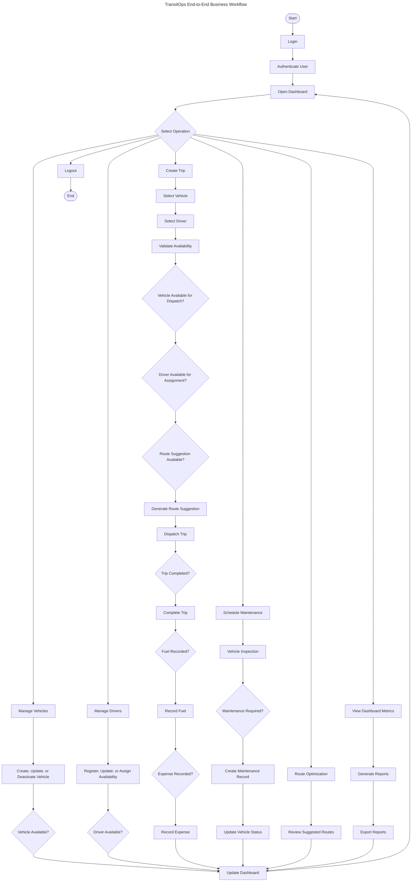

# TransitOps System Business Flow

## Purpose

TransitOps manages fleet operations through one continuous operational workflow. The system coordinates users, vehicles, drivers, trips, maintenance, fuel, expenses, reports, and route suggestions so operational teams can move from planning to execution to business review.

The workflow is designed around the daily responsibilities of a transport operations team: prepare resources, plan trips, dispatch vehicles, capture operating costs, monitor fleet health, and review business performance.

## Business Overview

A fleet manager begins by logging in and reviewing the operational dashboard. From there, the manager can maintain vehicle records, manage driver availability, create trips, schedule maintenance, record operating costs, request route suggestions, and review business performance.

The lifecycle starts with operational readiness. Vehicles and drivers must be available before a trip can be created and dispatched. After dispatch, the trip moves toward completion, fuel and expenses are recorded, and the dashboard and reports reflect the updated business state.

TransitOps also supports continuous operational control. Maintenance can temporarily remove vehicles from availability, route suggestions assist trip planning, and reports give decision-makers a historical view of trips, costs, driver performance, and maintenance spend.

## Business Flowchart

## Business Workflow Explanation

Authentication is the business entry point. A user signs in and gains access to the operational capabilities appropriate to their role.

Fleet Management keeps vehicle information current. The business team can add vehicles, update vehicle details, mark vehicles inactive when needed, and confirm whether vehicles are ready for operations.

Driver Management keeps driver information and availability current. Drivers can be registered, updated, and marked according to operational availability so trips are assigned only to suitable drivers.

Trip Operations is the central workflow. A trip is planned by selecting a vehicle and driver, validating availability, using route suggestions when available, dispatching the trip, and completing the trip after execution.

Maintenance protects operational reliability. When a vehicle requires inspection or service, a maintenance record is created and the vehicle availability is updated so it is not treated as ready for dispatch.

Fuel recording captures the direct operating cost of completed movement. Fuel information helps the business understand consumption and supports later performance analysis.

Expense recording captures additional vehicle-related operating costs. These costs provide a fuller view of business performance beyond trip revenue alone.

Reporting turns operational activity into business insight. The dashboard summarizes current activity, while reports aggregate historical trips, costs, driver performance, and maintenance information.

Route Optimization supports trip planning by providing route suggestions. These suggestions help the business estimate distance and duration before or during trip planning.

## Primary Business Actors

| Actor | Responsibilities | Modules Used |
| --- | --- | --- |
| Fleet Manager | Oversees fleet readiness, vehicle records, trip planning, dispatch activity, maintenance coordination, dashboard review, and reporting | Vehicle Registry, Trip Lifecycle Management, Maintenance Tracking, Operational Dashboard, Reporting & Analytics, Route Optimization |
| Driver | Participates in trip execution and operational trip status updates where permitted | Trip Lifecycle Management |
| Safety Officer | Maintains driver readiness, safety-related driver details, and operational eligibility | Driver Management |
| Financial Analyst | Reviews and records operational fuel and expense information and uses reports for cost analysis | Fuel & Expense Tracking, Reporting & Analytics, Operational Dashboard |

## Operational Business Rules

Only available vehicles may be dispatched. A vehicle that is already on a trip, under maintenance, or inactive should not be selected for a new trip.

Only available drivers may be assigned. A driver must be operationally available and eligible before being assigned to a trip.

Completed trips require operational cost recording. Fuel and expense records help the business understand the real cost of transportation activity.

Maintenance changes vehicle availability. When service is required, the vehicle is removed from normal dispatch readiness until maintenance is completed.

The dashboard summarizes operational activity. It gives the business a current view of fleet status, driver status, trips, costs, revenue, and safety indicators.

Reports aggregate historical business information. They support review of trip performance, expense categories, driver performance, and maintenance cost.

Route suggestions assist trip planning. They support better operational decisions before dispatch by estimating route distance and duration.

## Key Takeaways

- TransitOps connects fleet readiness, trip execution, cost tracking, and reporting in one operational workflow.
- Vehicles and drivers must be available before trips can move forward.
- Trip completion drives cost capture through fuel and expense recording.
- Maintenance directly affects vehicle availability.
- Dashboard metrics provide current operational visibility.
- Reports provide historical business insight.
- Route suggestions support better trip planning decisions.
- The workflow is designed for transport operations teams and business review audiences.
