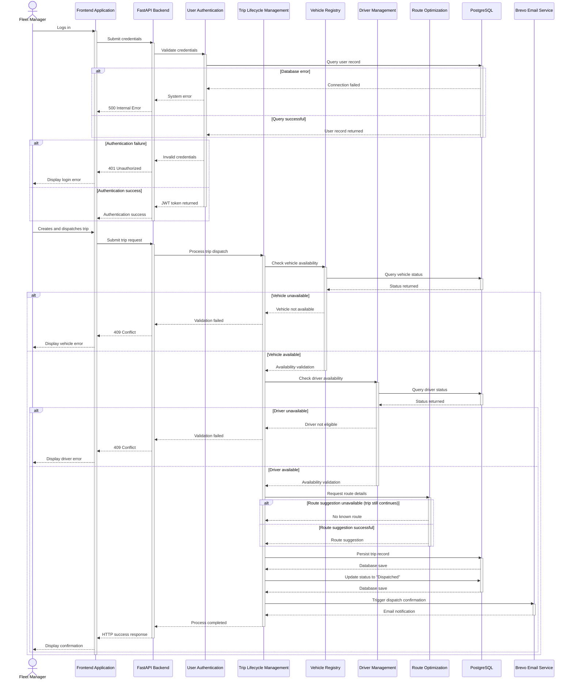

# TransitOps System Sequence Diagram

## Purpose

This document presents the system sequence diagram representing the end-to-end execution of creating and dispatching a transport trip. It illustrates the primary runtime interaction of TransitOps, tracing the request from the initial user action through the backend modules, database persistence, and external email notification.

The sequence demonstrates how the system enforces strict business rules across different modules—specifically validating vehicle and driver availability before allowing a trip to be dispatched and subsequently notifying the relevant stakeholders.

## Sequence Diagram

## Sequence Explanation

1. The Fleet Manager initiates the process by logging into the Frontend Application.
2. The FastAPI Backend routes the request to the User Authentication module, which queries PostgreSQL to verify the credentials.
3. Upon successful authentication, a JWT token is returned to the Frontend Application, granting access to the system.
4. The Fleet Manager submits the trip details to create and dispatch a new trip.
5. The Trip Lifecycle Management module orchestrates the validation process.
6. The Vehicle Registry is called to query PostgreSQL and confirm the selected vehicle is available for operation.
7. The Driver Management module is called to query PostgreSQL and confirm the selected driver is available and holds a valid license.
8. The Route Optimization module processes the source and destination to provide an optimized route suggestion, though the trip proceeds even if a route is not found.
9. With all business rules satisfied, Trip Lifecycle Management persists the new trip data into PostgreSQL.
10. The trip status is updated to "Dispatched" in the database, locking the vehicle and driver from other assignments.
11. The Brevo Email Service is invoked to send a dispatch confirmation to the required stakeholders.
12. The FastAPI Backend returns a successful HTTP success response to the Frontend Application, which then displays a success confirmation to the Fleet Manager.

## Business Rules

- Only authenticated users may dispatch trips.
- Only available vehicles may be assigned.
- Only available drivers may be assigned.
- Route suggestions are optional.
- Successful dispatch updates operational records.

## Key Takeaways

- The architecture correctly isolates domain logic while allowing cross-module orchestration through the Trip Lifecycle Management module.
- Strict availability validation prevents double-booking of physical assets.
- External dependencies, such as the Brevo Email Service and Route Optimization, are handled gracefully to prevent third-party failures from halting core business operations.
- Security is enforced at the entry point via the User Authentication module issuing JWT tokens.
- PostgreSQL acts as the single source of truth for all state transitions, utilizing transactional integrity to maintain operational consistency.
