# TransitOps Backend Architecture Documentation

## Purpose

TransitOps is an operations-focused backend for fleet, logistics, dispatch, maintenance, expenses, reporting, and ERP-style operational workflows. This document explains the implemented backend architecture for Odoo Hackathon evaluators, software architects, developers, and future contributors.

The backend is a FastAPI modular monolith implemented in Python. It uses Pydantic for request and response contracts, SQLAlchemy for ORM persistence, PostgreSQL as the database, JWT bearer authentication, role based access control, and Brevo for transactional email notifications.

This document represents the current backend only. It does not claim any Odoo platform integration, and it does not introduce missing infrastructure such as repositories, CQRS, event buses, queues, Redis, Celery, Kafka, microservices, Kubernetes, AWS, MinIO, or external authentication providers.

## Diagram

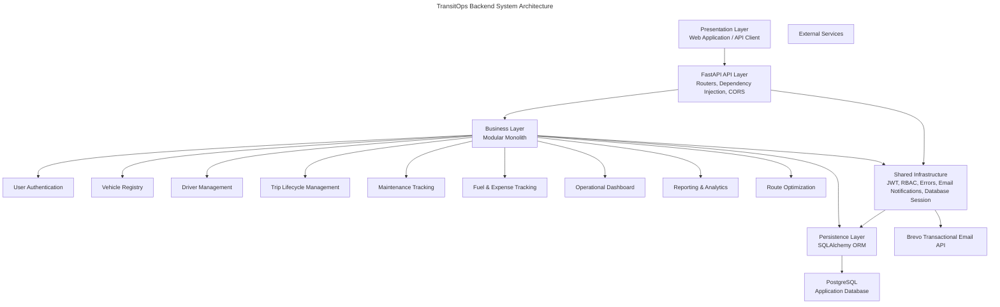

## Description

The architecture is intentionally direct and judge-readable. Each business capability is implemented as a backend module under the FastAPI application. HTTP routes are registered centrally under the `/api` prefix, then delegated to module transport layers. Business services enforce operational rules and persist changes through SQLAlchemy sessions.

The application creates database tables at startup from SQLAlchemy metadata. This is suitable for the current hackathon implementation and keeps the backend easy to run, inspect, and demonstrate.

## Important Notes

- TransitOps is a modular monolith, not a microservice system.
- There is no repository layer; service functions use SQLAlchemy directly.
- PostgreSQL is the only persistence service.
- Brevo is the only external API integration.
- Odoo integration is not present in the implemented backend.

## References

- `applications/backend_application/source/application_startup/create_application.py`
- `applications/backend_application/source/application_startup/register_routes.py`
- `applications/backend_application/source/modules`
- `applications/backend_application/source/shared_infrastructure`

# Request Lifecycle

## Purpose

This section documents how a request moves through TransitOps from the frontend or API client to the database and back to the caller.

## Diagram

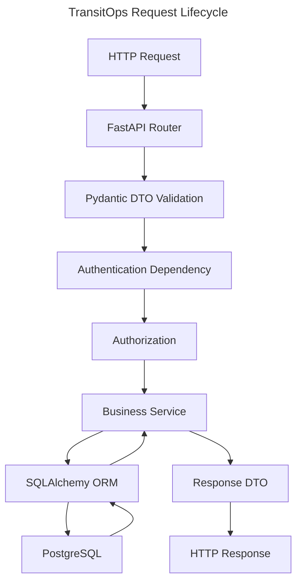

## Description

TransitOps follows a predictable request flow. FastAPI routes receive requests and validate input with Pydantic contracts. Protected routes resolve the current user through JWT bearer authentication and optionally enforce role restrictions. Business services then apply operational rules and read or write PostgreSQL records through SQLAlchemy ORM models. Route handlers map ORM records into response DTOs before returning HTTP responses.

## Important Notes

- Pydantic DTOs define API input and output contracts.
- JWT authentication is used for protected routes.
- Role based authorization is applied only where the operation requires specific roles.
- Business rules live in module service functions, not in database triggers or background workers.

## References

- User Authentication
- Shared Infrastructure
- All business modules

# Module Relationship View

## Purpose

This section shows how the implemented TransitOps modules relate to each other at a business-capability level.

## Diagram

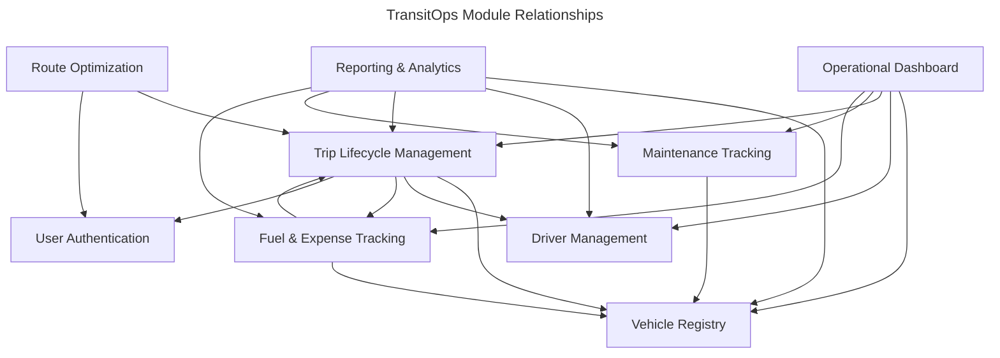

## Description

Trip Lifecycle Management is the operational center of the backend because it coordinates vehicles, drivers, trip state, fuel usage, and email notification behavior. Reporting and Operational Dashboard read across multiple operational tables to provide summarized visibility. Route Optimization can optionally associate suggestions with trips, while Maintenance Tracking and Fuel & Expense Tracking are vehicle-centered operational modules.

## Important Notes

- The relationships above are logical module dependencies based on implemented data and workflows.
- These are not service boundaries or network calls.
- All modules run in the same FastAPI backend process.

## References

- Trip Lifecycle Management
- Operational Dashboard
- Reporting & Analytics
- Route Optimization

# User Authentication

## Purpose

User Authentication verifies user credentials, issues JWT bearer tokens, and exposes the current authenticated user profile.

## Diagram

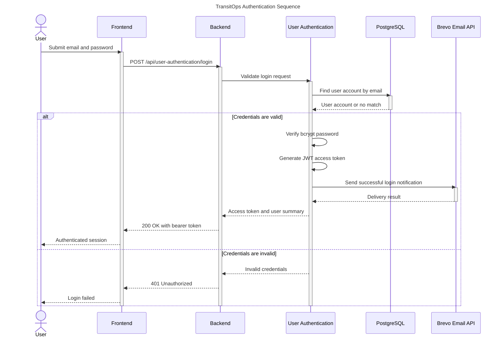

## Description

Authentication is local to TransitOps. The backend stores users in the `user_accounts` table with bcrypt password hashes. A successful login returns a JWT bearer token that clients use on protected API requests. Protected routes resolve the current user through JWT decoding and database lookup.

## Important Notes

- JWT algorithm: `HS256`.
- Token expiry: 12 hours.
- Roles: `fleet_manager`, `driver`, `safety_officer`, `financial_analyst`.
- Login sends a Brevo notification when email configuration is present.
- There is no external identity provider in the current backend.

## References

- `user_accounts`
- Shared RBAC infrastructure
- Brevo transactional email service

# Vehicle Registry

## Purpose

Vehicle Registry manages fleet vehicles, including registration, type, capacity, odometer, acquisition cost, region, and operational status.

## Diagram

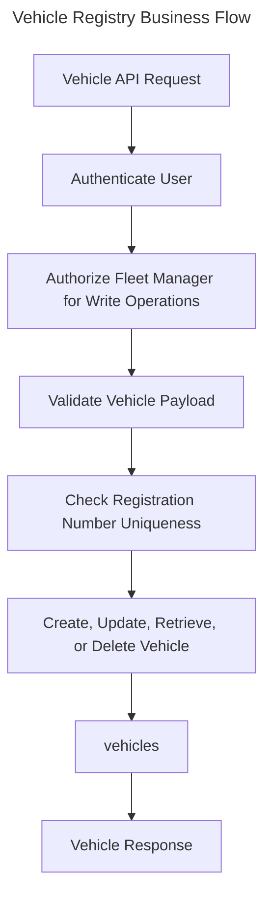

## Description

Vehicle Registry exposes vehicle CRUD endpoints and read-only helpers for available vehicles and regions. New vehicles are created as `available`. Vehicle availability is used by Trip Lifecycle Management to decide whether a vehicle can be assigned to a trip.

## Important Notes

- Vehicle registration numbers are unique.
- Vehicle statuses are `available`, `on_trip`, `in_shop`, and `retired`.
- Vehicle types are `truck`, `van`, `bike`, and `other`.
- Only fleet managers can create, update, or delete vehicles.

## References

- `vehicles`
- Trip Lifecycle Management
- Maintenance Tracking
- Fuel & Expense Tracking

# Driver Management

## Purpose

Driver Management manages driver records, license details, contact information, safety score, and operational availability.

## Diagram

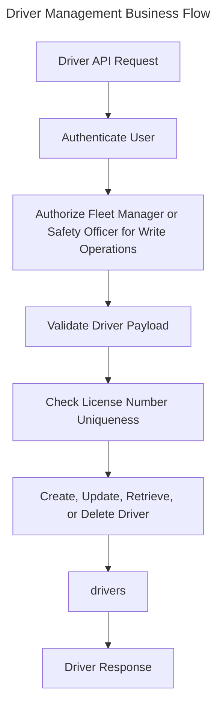

## Description

Driver Management maintains the operational driver pool. It exposes all-driver and available-driver views. Available drivers exclude suspended drivers, drivers already on trips, off-duty drivers, and drivers with expired licenses.

## Important Notes

- Driver license numbers are unique.
- Driver statuses are `available`, `on_trip`, `off_duty`, and `suspended`.
- Driver safety score is constrained from 0 to 100.
- Fleet managers and safety officers can create, update, or delete drivers.

## References

- `drivers`
- Trip Lifecycle Management
- Operational Dashboard
- Reporting & Analytics

# Trip Lifecycle Management

## Purpose

Trip Lifecycle Management coordinates the core dispatch process: trip drafting, dispatch, completion, cancellation, vehicle status changes, driver status changes, fuel log creation, and trip status email notifications.

## Diagram

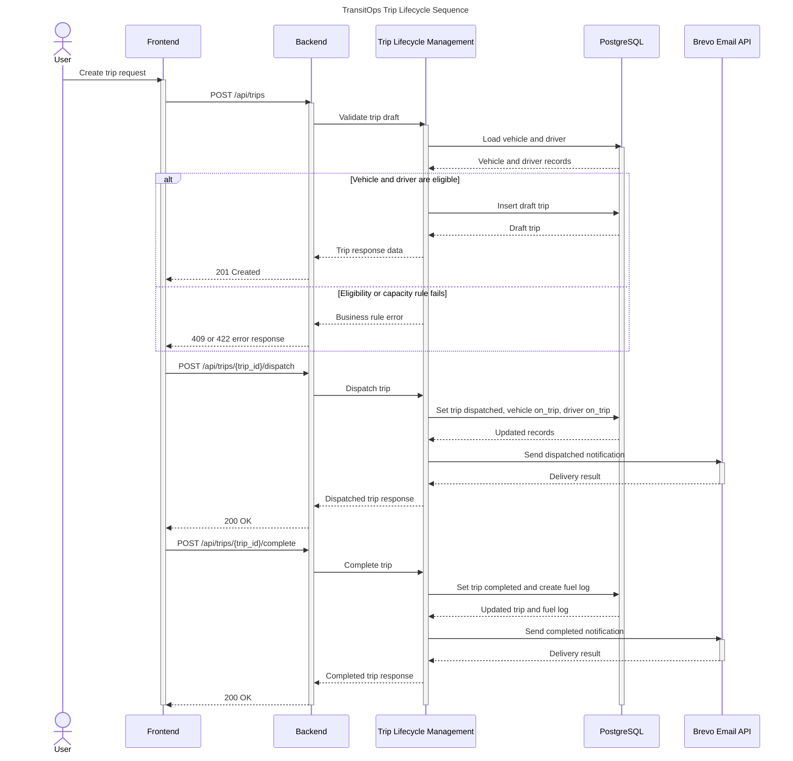

## Description

Trips move through a controlled lifecycle. A trip starts as a draft only after vehicle, driver, active assignment, license, suspension, and cargo-capacity rules pass. Dispatch moves the assigned vehicle and driver to `on_trip`. Completion records odometer and fuel usage, restores vehicle and driver availability, and creates a fuel log. Cancellation moves an active trip to `cancelled` and releases vehicle and driver if the trip was already dispatched.

## Important Notes

- Valid lifecycle states are `draft`, `dispatched`, `completed`, and `cancelled`.
- Cargo weight cannot exceed vehicle capacity.
- Suspended drivers and drivers with expired licenses cannot be assigned.
- Dispatch, completion, and cancellation can trigger Brevo status notifications.
- Completion creates a `fuel_logs` record automatically.

## References

- `trips`
- `vehicles`
- `drivers`
- `fuel_logs`
- User Authentication
- Brevo transactional email

# Maintenance Tracking

## Purpose

Maintenance Tracking manages active and closed vehicle maintenance records and updates vehicle operational status.

## Diagram

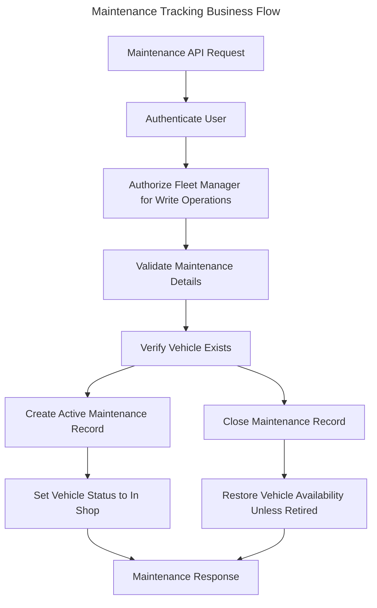

## Description

Maintenance records belong to vehicles. Creating a maintenance record marks the vehicle as `in_shop`. Closing the maintenance record marks it `closed` and returns the vehicle to `available` unless the vehicle has been retired.

## Important Notes

- Maintenance statuses are `active` and `closed`.
- Maintenance creation requires an existing vehicle.
- Only fleet managers can create or close maintenance records.
- Maintenance records support optional filtering by vehicle and status.

## References

- `maintenance_logs`
- `vehicles`
- Vehicle Registry

# Fuel & Expense Tracking

## Purpose

Fuel & Expense Tracking records operational fuel consumption and vehicle-related expenses for reporting and financial visibility.

## Diagram

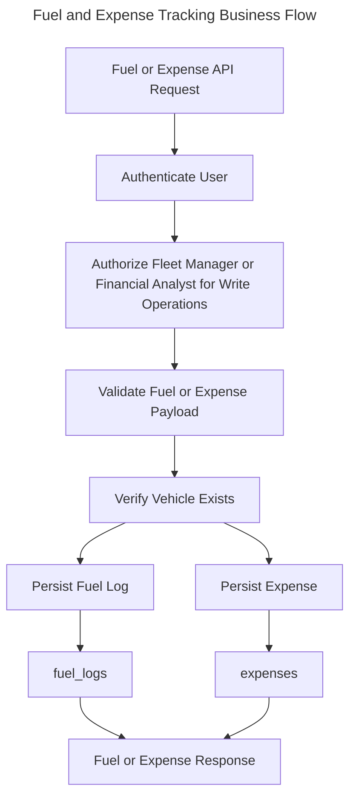

## Description

Fuel logs and expenses are linked to vehicles. Fuel logs may optionally be linked to trips. Manual creation requires an existing vehicle, while trip completion can create a fuel log automatically through Trip Lifecycle Management.

## Important Notes

- Fuel log liters and cost must be positive.
- Expense amount must be positive.
- Expense types can be listed for filter dropdowns.
- Fleet managers and financial analysts can create fuel logs and expenses.

## References

- `fuel_logs`
- `expenses`
- `vehicles`
- `trips`
- Trip Lifecycle Management

# Operational Dashboard

## Purpose

Operational Dashboard gives a current operational snapshot of the fleet, drivers, trips, financial totals, utilization, and safety indicators.

## Diagram

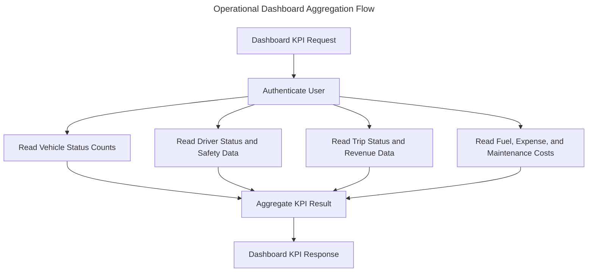

## Description

The dashboard module reads across operational tables and returns a single KPI payload. It does not mutate business data. It calculates totals, status breakdowns, revenue, fuel cost, expenses, maintenance cost, fleet utilization, average safety score, and expired license count.

## Important Notes

- Dashboard routes require authentication.
- The dashboard aggregates current database state.
- It reads from multiple modules but remains inside the same backend process.

## References

- `vehicles`
- `drivers`
- `trips`
- `fuel_logs`
- `expenses`
- `maintenance_logs`

# Reporting & Analytics

## Purpose

Reporting & Analytics generates operational reports and exports them as JSON, CSV, or PDF responses.

## Diagram

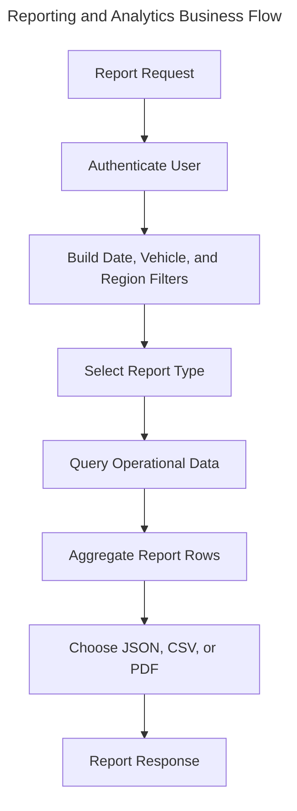

## Description

Reporting & Analytics provides four report families: trip summary, expense breakdown, driver performance, and maintenance cost. Each report can be returned as structured JSON. CSV and PDF exports are generated in memory and returned directly in the HTTP response.

## Important Notes

- Reports require authentication.
- PDF export uses ReportLab.
- CSV export uses Python CSV generation.
- No files are stored for generated reports.

## References

- `vehicles`
- `drivers`
- `trips`
- `fuel_logs`
- `expenses`
- `maintenance_logs`

# Route Optimization

## Purpose

Route Optimization suggests and stores route distance and duration estimates for supported Ahmedabad and Gujarat routes.

## Diagram

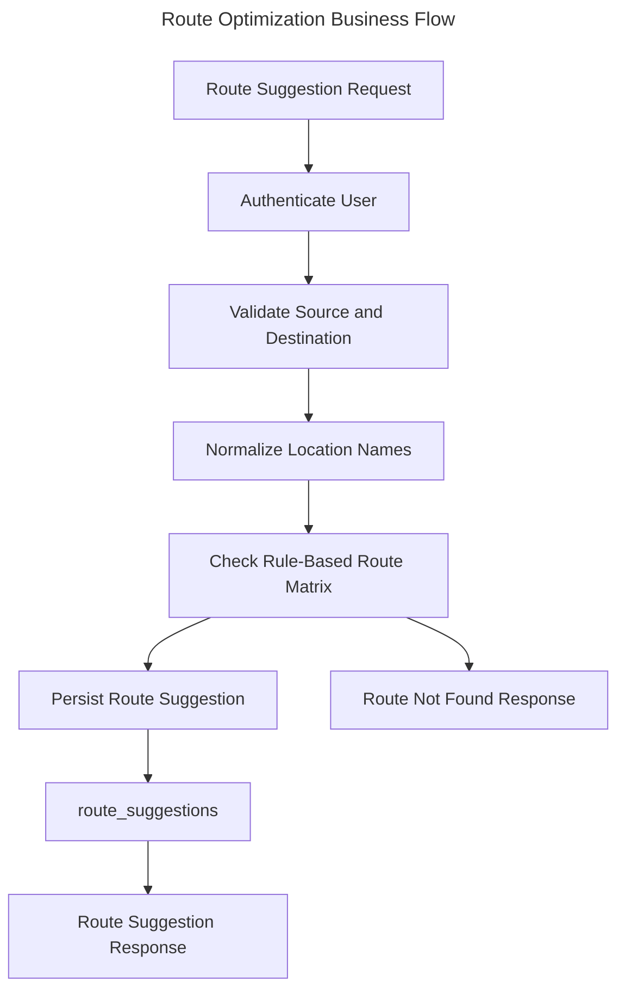

## Description

Route Optimization currently uses a rule-based matrix for known Ahmedabad and Gujarat routes. It supports direct, reverse, and partial matches. Successful suggestions are persisted to `route_suggestions`; unsupported routes return a not-found response.

## Important Notes

- The current provider is rule based.
- The `RouteProvider` enum contains `google`, but no Google Maps integration is implemented.
- Suggestions may optionally reference a trip through `trip_id`.

## References

- `route_suggestions`
- `trips`
- Trip Lifecycle Management

# Database Overview

## Purpose

This section documents the implemented PostgreSQL schema as represented by SQLAlchemy ORM models.

## Diagram

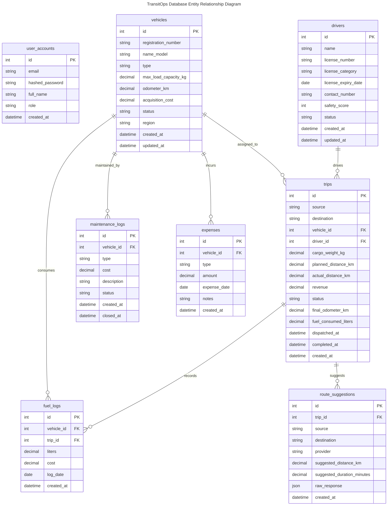

## Description

The database contains eight implemented tables. Business modules use SQLAlchemy ORM models to access these tables directly. Relationships are represented through foreign keys and joined ORM relationships where implemented.

## Important Notes

- `user_accounts.email` is unique.
- `vehicles.registration_number` is unique.
- `drivers.license_number` is unique.
- `fuel_logs.trip_id` is nullable.
- `route_suggestions.trip_id` is nullable.
- No additional tables are implemented.

## References

- SQLAlchemy database models under `shared_infrastructure/database_models`

# API Route Inventory

## Purpose

This section provides a concise view of the implemented HTTP API surface grouped by module.

## Diagram

```mermaid
---
title: TransitOps API Surface by Module
---
graph TB
    API["/api"]
    UserAuthentication["User Authentication<br/>/user-authentication/login<br/>/user-authentication/current-user"]
    VehicleRegistry["Vehicle Registry<br/>/vehicles<br/>/vehicles/available<br/>/vehicles/regions<br/>/vehicles/{vehicle_id}"]
    DriverManagement["Driver Management<br/>/drivers<br/>/drivers/available<br/>/drivers/{driver_id}"]
    TripLifecycleManagement["Trip Lifecycle Management<br/>/trips<br/>/trips/{trip_id}<br/>/trips/{trip_id}/dispatch<br/>/trips/{trip_id}/complete<br/>/trips/{trip_id}/cancel"]
    MaintenanceTracking["Maintenance Tracking<br/>/maintenance<br/>/maintenance/{maintenance_id}<br/>/maintenance/{maintenance_id}/close"]
    FuelExpenseTracking["Fuel & Expense Tracking<br/>/fuel-logs<br/>/expenses<br/>/expenses/types"]
    OperationalDashboard["Operational Dashboard<br/>/dashboard/kpis"]
    ReportingAnalytics["Reporting & Analytics<br/>/reports/trip-summary<br/>/reports/expense-breakdown<br/>/reports/driver-performance<br/>/reports/maintenance-cost<br/>CSV and PDF exports"]
    RouteOptimization["Route Optimization<br/>/routes/suggest<br/>/routes/suggestions<br/>/routes/available-routes"]

    API --> UserAuthentication
    API --> VehicleRegistry
    API --> DriverManagement
    API --> TripLifecycleManagement
    API --> MaintenanceTracking
    API --> FuelExpenseTracking
    API --> OperationalDashboard
    API --> ReportingAnalytics
    API --> RouteOptimization
```

## Description

All module routes are mounted under the `/api` prefix by the centralized route registration function. A health route is also exposed at `/api/health`.

## Important Notes

- Write operations are role restricted.
- Read operations generally require authentication.
- Authentication login is public.
- CSV and PDF report exports are generated directly by the backend.

## References

- FastAPI router transport files under `source/modules`
- `application_startup/register_routes.py`

# External Services and Non-Implemented Infrastructure

## Purpose

This section clarifies which infrastructure is implemented and which commonly expected services are not part of the current backend.

## Diagram

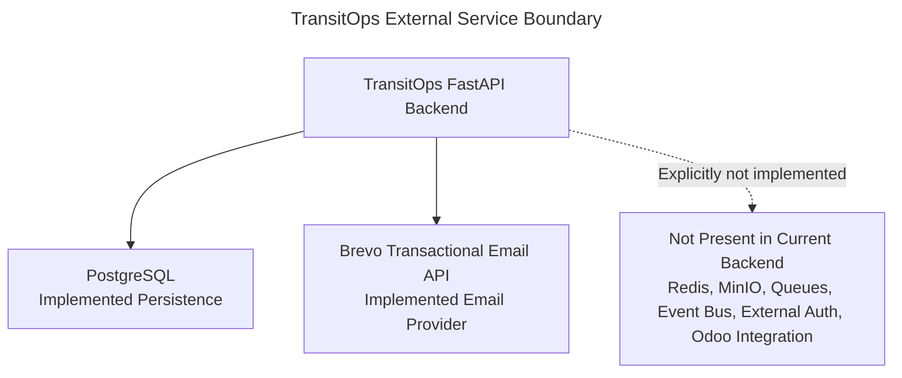

## Description

TransitOps currently uses PostgreSQL for application persistence and Brevo for transactional emails. No other external infrastructure service is implemented in the backend.

## Important Notes

- Redis is not implemented.
- MinIO is not implemented.
- Queues and queue consumers are not implemented.
- Event bus behavior is not implemented.
- Celery, Kafka, and RabbitMQ are not implemented.
- External authentication providers are not implemented.
- Odoo integration is not implemented.
- Object storage is not implemented.

## References

- `application_startup/database_connection.py`
- `shared_infrastructure/brevo_email_service.py`
- `shared_infrastructure/transit_ops_email_notifications.py`

# Quality Verification

## Purpose

This section records the architectural verification criteria used for this document.

## Diagram

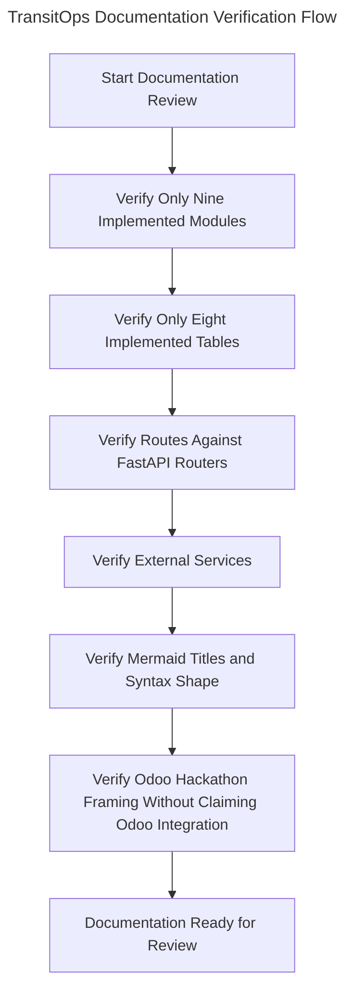

## Description

The documentation was prepared to be readable within a short judging window while preserving implementation accuracy. The diagrams emphasize architecture and business processes rather than Python functions or internal source-code mechanics.

## Important Notes

- No fake modules are included.
- No fake tables are included.
- No fake APIs are included.
- No fake infrastructure services are included.
- Mermaid diagrams use titles.
- Business names use full module names.
- The document is framed for Odoo Hackathon evaluation without claiming Odoo integration.

## References

- TransitOps backend source modules
- TransitOps shared infrastructure
- SQLAlchemy model definitions
